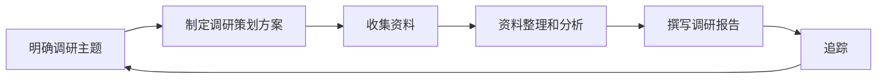

### 市场调研概念

> P 2
>

### 市场调研特征

> P 3

目的性，科学性，实践性，不确定性，系统性，时效性

### 市场调研的类别

> P 4

**探索性调研的目的**
确定调研主题及相关的问题和概念；确定调研对象；为选择最后的市场调研方式提供依据；获得修改调查问卷或实验设计的依据

**描述性调研的内容**
确定调研主题及相关的问题和概念；确定调研对象；为选择最后的市场调研方式提供依据；获得修改调查问卷或实验设计的依据

**描述性调研的内容**
市场整体环境特征；描述购买者的各种特征；分析主要竞争对手的实力及其营销策略的特征；公司经营战略和营销战略在实施过程中各阶段取得的实际效果

**因果调研的内容**
验证某种理论上存在的具有因果关系的现象；建立因果关系模型；确定影响调研目标的主要原因

### 市场调研的内容

> P 6

市场需求调研；市场环境调研；市场竞争调研；市场营销组合调研

### 市场营销信息系统的概念

它是一个包括人、设备和程序的体系，它收集、挑选、分析、评估和分配恰当的、及时的和准确的信息给市场营销决策者。

### 市场营销信息系统的组成

**内部报告系统**：
内部报表所产生的各种信息

**营销情报系统**：
公司主管用以获得日常的关于营销环境发展的信息

**决策支持系统**：
使用工具和技术对收集的数据进行评估

**市场调研系统**

### 计算机在市场调研中的应用

识别无序状态或问题；选择资料分析方法；设计调查问卷；选择样本；实施调查；资料分析

### 国内市场调研发展历程

典型调查时期；自主调查时期；决策导向时期；网络调研时期

### 市场调研的局限性

无法开展市场调研的情况；调查成本超过收益；缺乏资金；没有充足的时间；已经拥有信息

### 二手资料收集的涵义

二手资料也称案头资料，是指在某处已经存在，并已经按某种目的编辑起来的资料；二手资料调研方法就是利用间接的或者过去收集的，对当前问题有关的资料进行调研的方法。

### 二手资料收集方法的优缺点

优点：适用范围广资料数量多 经济快捷降低调查成本 受控因素少获取方式灵活 相对可靠比较实用

缺点：缺乏专业技术人员 度量标准不同 数据过时 信息筛选工作量大 报告单位不一致 对数据分类所使用的定义不同

### 二手资料种类

**按载体不同**
可分为书面资料和电子资料
**按范围不同**
可分为宏观资料和微观资料
**按时点不同**
可分为动态资料和静态资料

### 二手资料的来源

**内部来源**
生产经营活动方面的资料  市场环境方面的资料
**外部来源**
新闻媒体资料  政府统计资料  行业统计资料   咨询公司的情报  学术研究成果  金融机构资料

### 二手资料评价标准

二手资料的提供者  二手资料收集的目的  二手资料的时效性  二手资料的研究方法  二手资料的一致性

### 标准化信息的应用

测试消费者态度和意见；定义细分市场；市场追踪研究；监测媒体使用习惯

### 市场调研流程

> P 20

### 市场调研策划方案

> P 23

**基本原则**

科学性原则  可行性原则  有效性原则  弹性原则

**方案设计流程**

**策划方案评价**

逻辑分析法  经验判断法  试点调研法

### 市场调研主题的确定

> P 28

**经营管理问题与市场调研问题的区别**

**定义市场调研问题易犯的错误**

定义太宽  定义太窄

### 定性调研和定量调研的含义

**定性调研**的数据收集、分析、说明，都是通过对人们的言谈举止的观察和陈述来进行的，它是一种非程序化的、非常灵活的、基于问题的性质的研究方法。

**定量调研**是利用程序化和标准化的技术和方法对所收集的资料进行量化分析和处理的过程，它是基于问题的数量的研究。

### 定性调研和定量调研的区别

|调研方面| 定性调研 |定量调研|
| :--: | :--: | :--: |
|共同目的|发现想法,用于探索性调研|测试假设或者具体的调研问题|
|方法| 观察和解释 |测量和抽样|
|数据收集方法| 没有结构，形式自由 |提供有结构的回答类别|
|调研人员的独立性 |调研人员密切参与，结果是主观的|调研人员不参与观察，结果是客观的|
|样本|样本小|大样本，产生可普及的结果|
|最常用|探索性调研设计|描述性或因果关系的调研|

### 定性调研的应用

新产品市场定位  消费者态度和行为特征  产品测试  用户满意度  产品包装  营销传播概念  广告创意和制作的评估  品牌形象研究  行业研究  典型单位调查

### 定性调研的局限性

定性调研不能像大规模的定量调研一样区分出细微的差别，而营销组合的细微差别经常会决定营销工作的成败。

定性调研不能提供研究的目标群体中有代表性的样本，因为定性调研所采用的小样本很难代表整体的倾向。

容易出现小组讨论偏离研究主题的现象。

### 定性调研方法

*焦点小组访谈法  深度访谈法  投射法  过程分析*

#### 焦点小组访谈法

就是采用小型座谈会的形式，挑选一组具有代表性的消费者或客户，在一个装有单面镜或录音录像设备的房间内（在隔壁的房间里可以观察座谈会的进程），在主持人的主持下，就某个专题进行讨论，从而获得对有关问题的深入了解。

##### 焦点小组访谈的应用

产生创意
揭示消费者对产品或服务的需要、动机、观念和态度
理解消费者的词汇
理解定量调研的结果

##### 焦点小组访谈的优缺点

优点：资料收集快、效率高；结构灵活；能将调查与讨论相结合；可进行科学监测 

缺点：对主持人的要求较高；焦点座谈会的结果与其他调查方法的结果相比，容易造
成判断错误；进行资料分析和解释都很困难；有些涉及隐私、保密等问题，也不宜在会上多谈； 受讨论时间限制，有时很难进行深入细致的交流。

##### 焦点小组工作流程

##### 受访者筛选

经历或经验  均分配额  个性特点   排除对象

#### 投射法

是指让被调查者完成一定的作业，然后通过对作业的分析来了解被调查者的态度和动机。

##### 投射法的类型

**字词联想法**: 自由联想法  引导联想法   控制联想法

**完成法**:句子完成法  故事完成法

**结构法**:图片测试  卡通试验法

**表现法**:类比法  第三者技法

##### **可结合焦点小组访谈使用的投射技术**

#### 深度访谈法

深度访谈法是指调查人员和一名受访者在放松自然的气氛中围绕某一问题进行深入的讨论，目的是让受访者自由发言，充分表达自己的观点和感情。

##### 深度访谈法的应用

交流检验；感官评价；探索性调研；新产品开发；包装或用法调研

##### **深度访谈法的工作流程**

##### 深度访谈法的优缺点

优点：由于消除了群体压力，可以获得较真实、全面的信息资料；近距离的接触，使调研人员有机会观察被调查者的态度、表情、行为等，并以此来评价资料的可信度；调研人员与被调查者关系比较融洽；调研人员可以通过重复询问或解释问题，深入地探查被调查者的动机、感受等。

缺点：成本较高，尤其是当被调查者人数很多时；对调研人员的素质、访谈技巧要求较高；调研人员消耗体力较多，一天内访谈人数有限；样本量小，偏差或误差较大；所得资料难以量化。

应用范围：了解一些复杂或抽象的问题，如动机、态度、感受等。

### 问卷设计

> P 32

调查问卷，也叫调查表、访问表或询问表，它是一种以书面形式了解被调查对象的反应和看法，并以此获得资料和信息的载体。

#### 调查问卷的作用

提供标准化的数据收集程序；问卷调查实施方便，时间省、效率高；提供答案记录工具，规范记录行为；有利于对资料进行统计处理和分析

#### 问卷设计的要求

P 33

#### 问卷设计程序

#### 问卷设计程序

P 34

#### 前期准备

同类或近似的问卷；同类或近似的相关产品的市场知识；同类或近似的国内外市场调研报告；与管理层商讨得来的信息资料

#### 问卷评估

问题是否必要；问卷是否过长；问卷是否搜集到足够的信息；避免看上去杂乱

#### 问卷预测试与修改

问卷是否被调查对象充分理解；是否反映了所需资料的内容；提供多项选择问句的答案；访问所需的平均时间

#### 问卷的组织结构

**眉头部分**

眉头一般由问卷名称、问卷编号、调查组织名称、城市编号、访问员、问卷复核人、问卷编码人、录入员等信息组成。

**开场白/前言**

开场白是由调研人员读出的或印在问卷上的调研情况的说明部分。

**包括**：*调查的目的和意义*
*回答注意事项*
*调查者身份*
*信息保密承诺*
*受访者免责声明*
*完成问卷的参考时间*
*联系方式、致谢与签名*

**筛选部分**
**主体部分**
**背景资料部分**
**结束语均时间**

#### 不同访问方式的问卷设计

**小组讨论**

前言较长
被调查者情况不必特别设计
调查的主体内容按大纲形式设计
无需问卷记录
眉头部分记录详细

**电话调查**

前言要简洁
被调查者情况要间接提问
问卷主体部分要口语化，而且要简短
记录要事前准备

**邮寄调查**

前言要详细全面
问卷主体内容可长可短
促进问卷的回收

#### 问题类型

P 39

#### 问题措辞注意事项

提的问题要具体，避免过于笼统
不能询问超过大多数被调查者能力的问题
提问要中性化
避免使用专业化的词汇
避免使用冗长复杂的句子
每个问题只能包含一项内容
问题中不应使用夸大事实的词汇

#### 敏感问题的处理

第三人称法 释难法 数值归档法 假设法

#### 答案设计

答案要穷尽  答案须互斥  所列答案是中立的立场

#### 问题顺序设计

### 态度测量

> P 45

**量表**：是为了便于记录某种程度而设计的区分标准，其作用是调研者对被访问对象的某些特性的数量或强度的测量。
**态度测量**：是市场调研人员根据被调查者的可能认识或认识态度，就某一问题列出若干答案，设计态度测量表，再根据被调查者的选择来确认其认识或认识程度的行为和过程。

#### 量表特征

❖ 特指
用某一特定的词、词语或符号，来代表度量的每个区分等级的特征值。
❖ 比较性
是特指的相对规模，即与某一参照体相比，受访者对特定对象所做的比较结果。
❖ 差异程度
量表同时反映对照物之间的差别和差别程度。

#### 量表层次

类别量表  顺序量表  等距量表   等比量表

|水平| 基本操作| 一般应用 |统计分析|
| :--: | :--: | :--: | :--: |
|类别 |判断相等或不等|归类 频数、百分比|众数|
|顺序 |判断更大或更小|排序/打分| 中位数|
|等距| 判断间距的相等性|复杂概念/偏好的测量| 均值/方差|
|等比 |判断等比的相等性|当精确工具可获得时 |几何平均数|

#### 市场调研常用量表

> P 47

#### 量表选项设计

> P 51

类别数目和奇偶性 —— 是否中立为普遍现象
平衡量表和非平衡量表 —— 肯定否定态度是否普遍
强制性量表和非强制性量表

### 问卷评价

> P 52

❖ 信度
即可靠性，它是指使用相同的研究技术重复测量同一对象得到相同结果的可能性。问卷调查结果的可信度和稳定性。
❖ 效度
是指问卷能否真正测量到所要测量的东西，也就是能否达到测量的目的，是否正确衡量了研究者所要了解属性的程度。问卷结果的准确性。

信度是效度的必要非充分条件，效度是信度的充分不必要条件

#### 信度评价

**重复检验法**
通过对同一种测量手段对同一群受访者前后测量两次，再根据两次测量的相关系数测定信度。
**交错法**
调研人员设计两份问卷，每份使用不同的问题，但测量的是同一属性，让同一群受访者回答。
**折半法**
将一份问卷中的问题随机分成两组，然后考察这两部分的测量结果的相关系数。

#### 效度评价

**表面效度**
是测量内容的适合性和相符性，要看问卷内容是否抓住或体现调查问题的所有或主要特征。
**准则效度**
用几种不同的测量方式或不同指标对同一变量进行测量时的一致性程度。
**建构效度**
如果问卷调查结果能够测量其理论特征，即问卷调查结果与理论预期一致，则认为有建构效度。

### 抽样

> P 58

#### 基本概念

> P 58
>

#### 抽样调查的特点

抽样调查节省人力、物力和财力
抽样调查更省时，收效更快
抽样调查具有更高的准确性
抽样调查能大大提高资料收集的广度和深度

#### 适用范围

对一些不可能或不必要进行全面调查的项目
在经费、人力、物力和时间有限的情况
运用抽样调查对全面调查或普查进行验证
对某种总体的假设进行检验

#### 流程

> P 59

#### 随机抽样

> P 62

##### **优缺点**

优点：省事、省力、省费用，并快速得到调研结果；能够计算调查结果的可靠性。
缺点：难以体现重点；范围广、时间长、费用多，参加人员多；需要专业技术人员进行

##### 简单随机抽样

是随机抽样技术中最简单的一种，它对调研总体不经过任何分组、排队、完全凭着偶然的机会从中抽取个体加以调查。**常用技术：抽签法，随机数码表法**

优点：方法简单，并且由于抽取概率相同，易于进行总体推断并计算抽样误差。
缺点：不适用于个体庞大，特性复杂的群体；不适用于某些场合；精确度较低，标准差较大；耗费人、财、物

##### 分层随机抽样

是先将调研总体的所有个体按某一重要标志进行分类，然后在各类中采用简单随机抽样的方法抽取样本个体。**常用方法：等比例分层抽样，非等比例分层抽样**

**等比例分层抽样:**按各层中的单位数量占总体的比例分配各层样本的方法。 适用于各类型之间差异不大的分类调查。

**非等比例分层抽样:**根据其他因素，调整各层的样本个体数，即有的层可多抽些样本个体，有的可少抽些样本个体。 适用于各类总体的个体数相差悬殊或均方差相差较大的情况。
$$
n_i=\frac{n*N_iS_i}{\varSigma N_iS_i}
$$

##### 分群随机抽样

先把调查总体区分为若干个群体，然后用简单随机抽样法，从中抽取某些群体进行全面调查。

 优点：抽样框编制得以简化，实施调查便利、节约。

 缺点：抽样误差较大，代表性较差。

##### **系统抽样**

排序等距离抽样
计算公式：抽样间隔=总体数（N)/样本数（n)
优点：简便易行，容易确定样本单位。样本单位在总体中分布比较均匀，有利于提高估计精度。
缺点：前提是要有调研总体每个个体的有关资料；当抽选间隔和被调查对象本身的节奏相重合时，会影响调查的精度。

##### 多阶段随机抽样

是把从市场调查总体中抽取样本的过程，分成两个或两个以上的阶段进行随机抽样的方法。

例：调查四川省农村居民家庭人均年收入的情况。
抽取县  抽取乡  抽取村  抽取户

#### 非随机抽样

> P 66

对总体中每一个体不具有被平等抽取的机会，而是根据一定主观标准来抽选样本的抽样技术。

##### 优缺点

优点：选取样本较典型；可以缩小抽样范围，节省时间、人员和费用
缺点：无法判断抽样误差；调查者不知道被抽中的单位所具有代表性的程度

##### 任意抽样

街头抽样法 空间抽样法

优点：简单易行，可及时获得所需的资料，节约时间和费用。
缺点：抽样偏差较大，可信度较低；样本没有足够的代表性。
适用于非正式的探测性调查，或调查前的准备工作

##### **判断抽样**

专家判断选择样本；统计判断选择样本

适用于各调查个体差异较小，调查单位较少，选择的样本有较大代表性时采用。

##### **配额抽样**

> P 68
>

##### **滚雪球抽样**

> P 69
>

#### **抽样方法的比较和选择**

对抽样误差大小的要求  调查对象本身的特点  人力、物力、经费和时间等各种调查条件

#### 抽样误差测定

调查误差包括登记性误差和代表性误差。

抽样误差是指在采用随机抽样技术时，由调查结果推算全体时，预先能算出来的误差，即平均误差。

##### **影响抽样误差的因素**

总体单位之间的标志变异程度  样本单位的数目多少  抽样方法不同

##### **抽样误差的控制**

准确选定抽样方法  正确确定样本数目   加强组织领导

##### 抽样误差计算公式 

> P 71
>

#### 样本容量的确定

##### 计算公式

>  P 72
>

##### **从小总体中抽样**

小总体是指样本超过总体规模的5%
$$
小总体样本容量=样本容量公式*\sqrt{\frac{N-n}{N-1}}
$$

#### 抽样推断

> P 73
>

### 实地调研方法

询问法  观察法  实验法  网络调查   现场误差

#### 询问法 

> P 100

询问法是指调查人员直接向被调查者提出问题，以获得信息资料的调查方法，也称为直接调查法，是市场调查中最常用的一种方法。

优点：问卷填制容易；数据可靠；易于执行
缺点：受访者可能不能回答或不愿回答；答案的不完备性

##### 入户访问的工作流程

##### 拦截式访问的工作流程

##### 电话访问的工作流程

##### 邮寄调查法的工作流程

##### 留置问卷调查的工作流程

#### 观察法

> P 107

##### 观察法的类型

结构观察和无结构观察（观察方式不同)
自然观察和实验观察（是否对观察进行控制）
直接观察和间接观察（介入程度不同）
人工观察和机器观察（观察主体不同）

#### 实验法

> P 114

#### 网络调查

> P 118

#### 样本设计误差

抽样框误差 
调查对象范围误差 
抽选误差

#### 测量误差

替代信息误差
调研人员误差 
测量工具误差 
处理过程误差 
回答误差

### 资料整理与分析

#### 资料整理程序

#### 数据资料分析

> P 153

##### 集中趋势的概况技术

众数，中位数，平均数
##### 离中趋势的概况技术

全距：是指一组数据中最大值与最小值之差
平均差：是指一组数据内的每个数与平均数的差的绝对值的算术平均数。
$$
AD=\frac{\varSigma \left| x-\bar{x} \right|}{N}
$$
平均差系数：平均差系数=(AD/x)*100%
标准差，标准差系数

##### 交叉列表分析

P 157

##### t检验

P 163

##### 方差分析

P 165

##### 相关分析和回归分析

P 169

##### 判别分析

P 175

##### 因子分析

应用：
消费者使用习惯和态度研究
品牌形象和产品属性
目标市场接触广告媒体的习惯
寻找价格敏感型消费者的特征
满意度研究

##### 聚类分析

应用：
市场细分
了解购买行为
开发新产品
设计抽样方案（分层抽样）